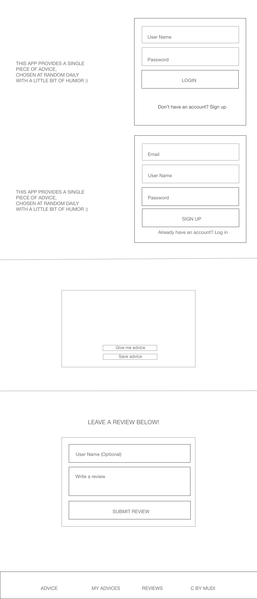

##Mod3-project-Daniel

##application url

##which API I'm using

api.adviceslip.com

##problem statement
An app that provides advice but also in a funny humorous way. Certain people get anxious when getting advice of tension. This should help

##target users
The target users are people who want to laugh while also figuring out next steps

###Technologies used
Used React, Spring, Java , Axios, Link from React-Dom .

###Problem i was not able to solve was getting the advices to render on myadvice page  it popped up and let me delete but the actual advices didn't show.

## Wireframe
